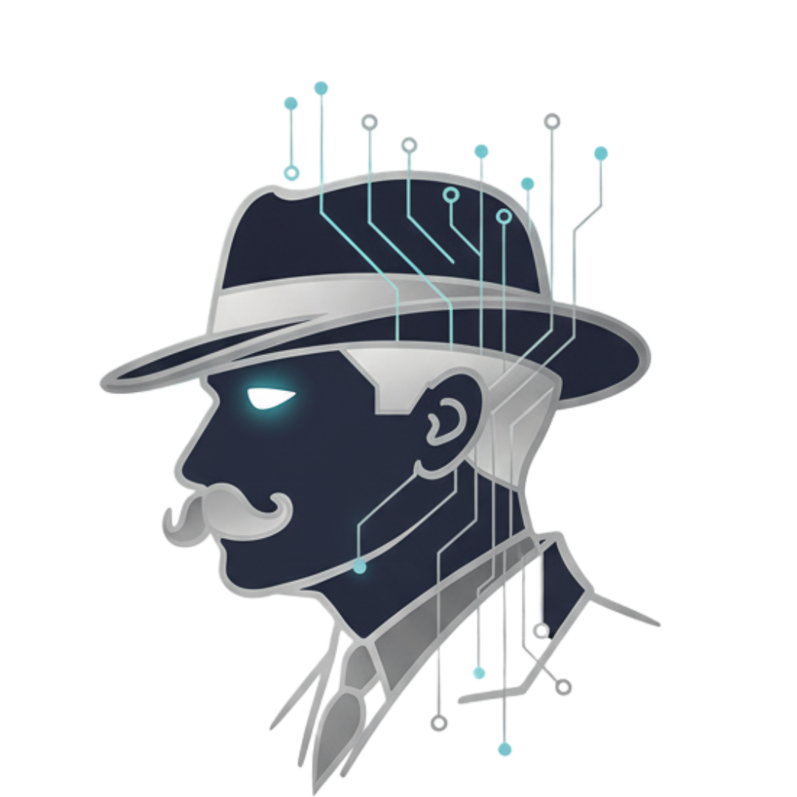

<div align="center">
  

  <h1>Poirot</h1>
  <p><em>"The impossible could not have happened, therefore the impossible must be possible in spite of appearances."</em></p>

  <p>
    <strong>A meticulous, multi-modal AI investigation agent.</strong><br/>
    Give it a case directory. It reads every file, watches every frame, listens to every word —<br/>
    and reasons its way to the truth.
  </p>

  <p>
    
    
    
    
  </p>
</div>

---

## What is Poirot?

Poirot is an agentic investigation skill for AI assistants. Point it at a directory containing case files — documents, images, audio, video, spreadsheets, emails, anything — and it will:

1. **Ingest & understand** all textual evidence, building a structured Case Knowledge Base (CKB) with entities, timelines, contradictions, and information gaps.
2. **Classify & route** every piece of evidence by modality and relevance, assigning optimal LLM/VLLM models to each analysis task based on live model availability.
3. **Analyse images** with a rigorous two-pass VQA pipeline — neutral observation first, then derived follow-up questions, then conditional deep-dives only when anomalies are genuinely suspicious.
4. **Transcribe and analyse audio and video** — neutral transcription, element extraction, derived questions, conditional deep-drills.
5. **Synthesise all findings** into a structured investigation report grounded in explicit logical chains, epistemic states, and deductive reasoning — never speculation dressed as fact.

Poirot is **not a fixed pipeline**. The agent exercises judgment at every step, deciding which scripts to run, in what order, and with what parameters — based on what the evidence actually demands.

---

## Key Features

- 🔍 **Fully deductive reasoning** — every claim is tagged with an epistemic state: `[E]` Established, `[S]` Suspicious, `[P]` Possible, `[X]` Excluded
- 🧠 **Live model routing** — fetches available models from your provider and assigns the best model to each task (vision, audio, reasoning, synthesis)
- 🎛️ **Provider agnostic** — OpenAI, Anthropic, Google, OpenRouter, Groq, Together, Mistral, or any local vLLM / Ollama server
- 🔑 **API key optional** — runs in agent passthrough mode with no key; the calling AI agent handles LLM calls natively
- 📷 **Adaptive VQA** — generates questions on the fly from observed elements; deep-drills only when evidence is genuinely anomalous
- 🎙️ **Audio / video intelligence** — Whisper transcription, DTE extraction, keyframe analysis, behavioural cues
- 📎 **Full citation** — every finding links back to the source file and timestamp
- 🗂️ **Agentic** — the agent reads output, re-evaluates, and decides what to run next

---

## Installation

```bash
git clone https://github.com/your-username/poirot.git
cd poirot

# Install dependencies (all optional — see requirements.txt for details)
pip install -r requirements.txt
```

**Requirements:** Python 3.10+. All external dependencies are optional — Poirot degrades gracefully when packages are absent.

**For audio/video analysis**, `ffmpeg` must be installed separately:
- macOS: `brew install ffmpeg`
- Ubuntu: `sudo apt install ffmpeg`
- Windows: [ffmpeg.org/download](https://ffmpeg.org/download.html)

---

## Quick Start

```bash
# Run the full pipeline on a case directory
python scripts/poirot_run.py --case /path/to/case/

# With a specific output directory
python scripts/poirot_run.py --case /path/to/case/ --output-dir /path/to/results/

# Skip phases you don't need
python scripts/poirot_run.py --case /path/to/case/ --skip-phases 4

# Use static model config (skip live model fetching)
python scripts/poirot_run.py --case /path/to/case/ --no-router
```

The pipeline writes all outputs to `<case_dir>/_poirot_output/` by default:

| File | Contents |
|---|---|
| `case_manifest.json` | Full file inventory with modalities |
| `case_knowledge_base.md` | Structured entity/timeline/contradiction notes |
| `evidence_manifest.json` | Classified evidence with analysis scaffolds |
| `image_analysis_report.md/json` | Per-image VQA findings |
| `av_analysis_report.md/json` | Audio/video transcription and analysis |
| `routing_plan.json` | Live model assignments per task |
| `logical_chains.md` | Cross-modal correlation working notes |
| `poirot_report.md` | **Final investigation report** |

---

## Configuration

API keys and model selection are **fully optional**. Poirot operates in three modes:

| Mode | When | Setup |
|---|---|---|
| **Agent** | No key, no provider configured | Nothing — the calling AI agent handles LLM calls natively |
| **Local** | `POIROT_LOCAL_URL` set | Point at Ollama / vLLM / LM Studio — no key needed |
| **Cloud** | API key present | Full live model fetch + optimal task routing |

### `.env` file (recommended for cloud use)

```bash
cp .env.example .env
# Edit .env — uncomment only the keys you need
```

```ini
# Pick one provider (or let Poirot auto-detect from whichever key is present)
OPENAI_API_KEY=sk-...
# ANTHROPIC_API_KEY=sk-ant-...
# GOOGLE_API_KEY=AIza...
# OPENROUTER_API_KEY=sk-or-...

# Optional: pin specific models instead of letting the router choose
# POIROT_TEXT_MODEL=gpt-4o-mini
# POIROT_VISION_MODEL=gpt-4o
# POIROT_AUDIO_MODEL=whisper-1

# Optional: use a local server (no key needed)
# POIROT_LOCAL_URL=http://localhost:11434/v1
# POIROT_LOCAL_MODEL=llava
```

If a required key is missing and Poirot is running in a terminal, it will **prompt you interactively**. You can leave it blank to fall back to agent/local mode.

---

## Supported File Types

| Modality | Formats |
|---|---|
| Text / Documents | `.txt` `.md` `.pdf` `.docx` `.odt` `.rtf` `.msg` `.eml` `.xlsx` `.csv` |
| Images | `.jpg` `.jpeg` `.png` `.gif` `.bmp` `.tiff` `.webp` `.heic` |
| Audio | `.mp3` `.wav` `.m4a` `.aac` `.flac` `.ogg` `.opus` `.wma` |
| Video | `.mp4` `.mov` `.avi` `.mkv` `.wmv` `.webm` `.m4v` `.mpeg` |

---

## Model Routing

Before any analysis, Poirot fetches the live model list from your provider and builds an optimal routing plan — assigning the best available model to each investigation task:

| Task | Selection criteria |
|---|---|
| CKB generation | Long-context + strongest reasoning |
| Evidence classification | Fast / cheap text model |
| Image VQA & DOE extraction | Best available vision model |
| Deep-drill (anomaly follow-up) | Premium vision model |
| Audio transcription | Native ASR; falls back to local Whisper |
| Video analysis | Vision + large context window |
| Synthesis | Strongest available reasoning model |

The routing plan is saved to `routing_plan.json` for inspection. Use `--no-router` to skip fetching and use static `.env` model settings.

**Supported providers for live model fetching:** OpenAI · Anthropic · Google · OpenRouter · Groq · Together · Mistral · Local (OpenAI-compatible)

---

## Reasoning Protocol

Poirot follows a strict epistemic discipline defined in `steps/00-reasoning-protocol.md`:

- **Observation before interpretation** — Pass 1 is always neutral description; no conclusions until elements are extracted.
- **Null hypothesis default** — every piece of evidence starts as unremarkable until proven otherwise.
- **No assumptions** — nothing is inferred without at least two corroborating data points.
- **Deep-drills are conditional** — a second analysis pass is only triggered when an observation is simultaneously *specific*, *anomalous*, and *materially relevant* to the case.
- **Epistemic states on every claim:**
  - `[E]` **Established** — directly observed, unambiguous, requires no inference
  - `[S]` **Suspicious** — warrants investigation, pattern detected but not confirmed
  - `[P]` **Possible** — plausible given the evidence, not yet corroborated
  - `[X]` **Excluded** — ruled out by contradicting evidence

---

## Agentic Use

Poirot is designed to be driven by an AI agent with full investigative discretion. The agent decides which scripts to run, in what order, and whether to re-run phases as new findings emerge.

**Run individual scripts directly:**

```bash
# Re-analyse a specific image after new context from text
python scripts/run_image_analysis.py \
  --evidence _poirot_output/evidence_manifest.json \
  --ckb _poirot_output/case_knowledge_base.md \
  --output-dir _poirot_output

# Re-synthesise after mid-investigation findings
python scripts/synthesize_report.py \
  --ckb _poirot_output/case_knowledge_base.md \
  --image-report _poirot_output/image_analysis_report.json \
  --av-report _poirot_output/av_analysis_report.json \
  --output-dir _poirot_output

# Inspect the routing plan for your provider and case
python scripts/model_router.py --provider openai --modalities text,image,audio
```

---

## Project Structure

```
poirot/
├── assets/                         Logo and visual assets
│   └── logo.png
├── scripts/                        Runnable investigation pipeline scripts
│   ├── poirot_run.py               Main entrypoint — full pipeline orchestrator
│   ├── env_config.py               .env loader, provider detection, key prompting
│   ├── model_router.py             Live model fetcher + optimal task routing
│   ├── ingest_case.py              Phase 1 — file scan, text extraction, CKB prompt
│   ├── classify_evidence.py        Phase 2 — evidence classification and scaffolding
│   ├── run_image_analysis.py       Phase 3 — adaptive VQA pipeline
│   ├── run_audio_video_analysis.py Phase 4 — audio/video transcription and analysis
│   └── synthesize_report.py        Phase 5 — cross-modal deductive synthesis
├── steps/                          Phase instruction documents (for AI agents)
│   ├── 00-reasoning-protocol.md    Orthological reasoning constitution
│   ├── 01-ingest-case.md
│   ├── 02-classify-evidence.md
│   ├── 03-image-analysis.md
│   ├── 04-audio-video-analysis.md
│   └── 05-synthesis-report.md
├── references/
│   ├── model_endpoints.md          Provider and model reference
│   └── supported_formats.md        Supported file formats per modality
├── examples/
│   └── sample_case_investigation.md
├── .env.example                    Configuration template
├── .gitignore
├── requirements.txt
├── SKILL.md                        AI agent skill definition
├── CONTRIBUTING.md
└── LICENSE
```

---

## Contributing

See [CONTRIBUTING.md](CONTRIBUTING.md).

---

## License

Creative Commons Attribution-NonCommercial 4.0 International (CC BY-NC 4.0) — see [LICENSE](LICENSE).

---

<div align="center">
  <sub>Built with the little grey cells &nbsp;🩶</sub>
</div>
